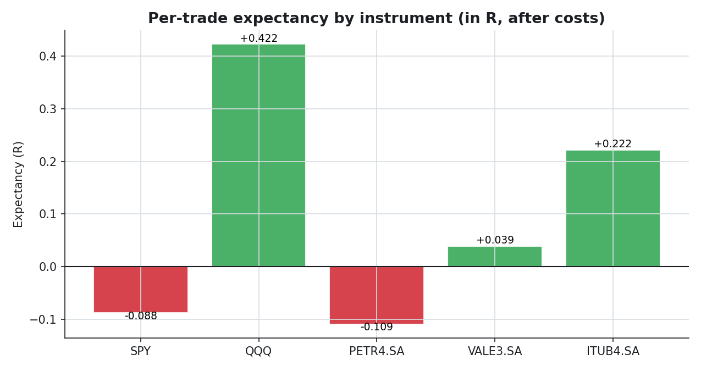
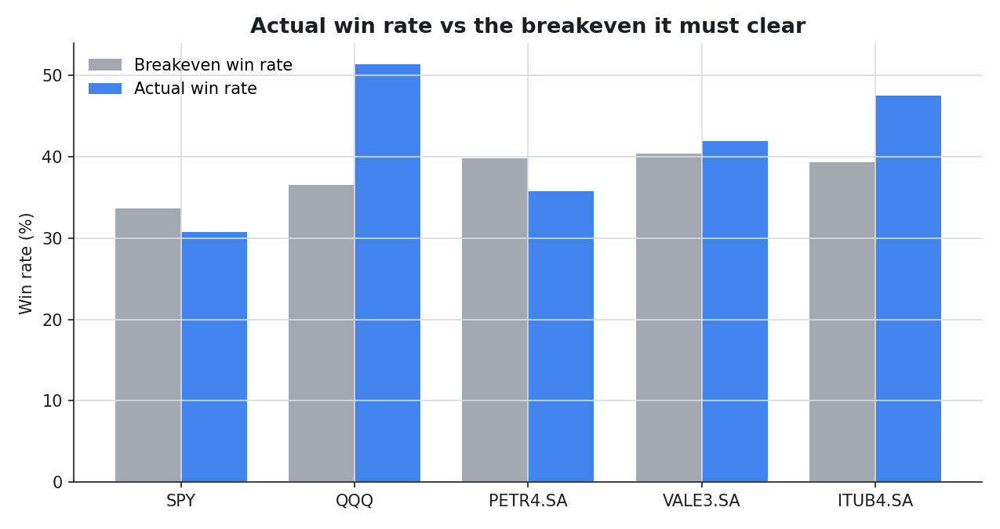
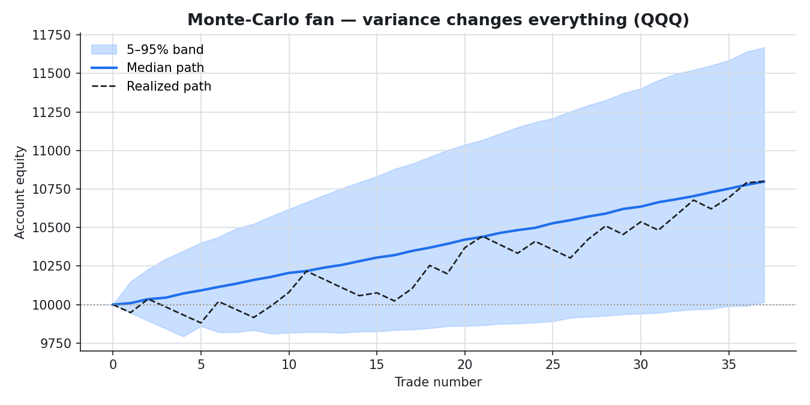
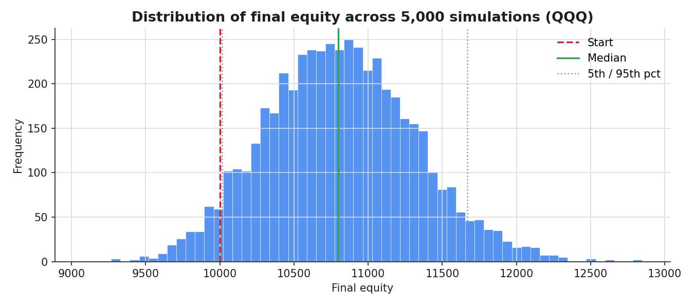
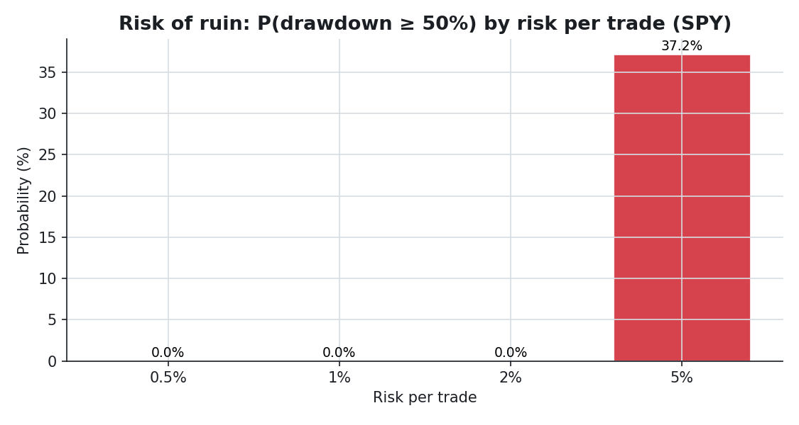
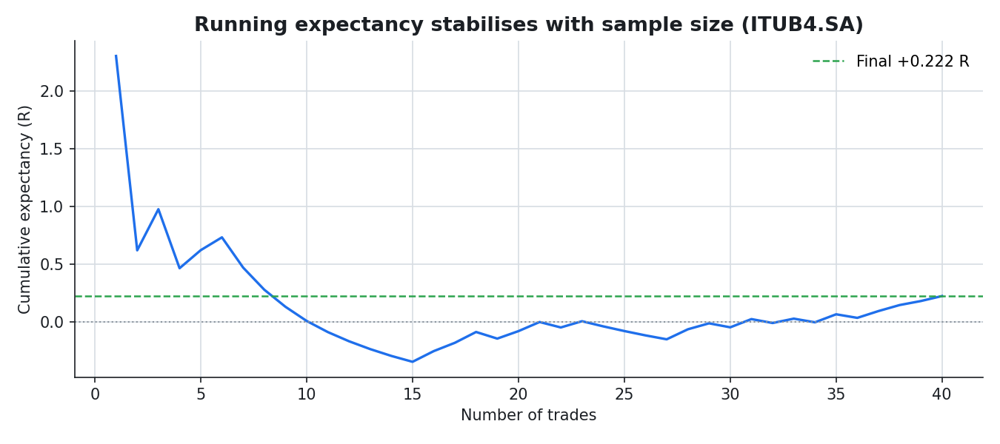

# Expectancy — The Mathematics of a Trading System

[](https://www.python.org/)
[](LICENSE)
[](tests/)
[](https://finance.yahoo.com/)
[](output/expectancy_study.pdf)

A rules-based backtester that measures the **mathematical fingerprint** of a trading system —
**win rate, expectancy, R-multiple, equity curve, max drawdown, variance and risk of ruin** — on real
OHLCV from Yahoo Finance. It is built around one non-negotiable principle: these numbers are **not
data you download**, they are **results of simulating a strategy** trade by trade, after costs, with
no lookahead.

The question this repo answers is not "what was the return?" but **"does this system have a real edge,
and could I survive the variance of trading it?"** It then runs the same example strategy across five
instruments and reports the answer without spin.

---

## TL;DR

- **The example strategy (MA20×MA50 crossover) has no robust edge.** After costs, its per-trade
  expectancy *flips sign across instruments*: QQQ **+0.42R** (Profit Factor 1.83) and ITUB4 **+0.22R**
  (PF 1.40) look good, while SPY (**−0.09R**) and PETR4 (**−0.11R**) lose. That spread, from the same
  rules, is the headline result.
- **Every instrument produced fewer than 100 trades** (37–43 over 16 years), so the backtester
  **flags all of them as noise-dominated**. A crossover on daily bars simply does not trade often
  enough for its expectancy to be trustworthy — which is exactly the "one trade means nothing" lesson,
  made concrete.
- **Variance dominates the experience.** Reshuffling QQQ's 37 trades 5,000 times, the outcome runs
  from a **4.7% chance of ending in the red** (despite a positive edge) to roughly **+17% at the 95th
  percentile** — same trades, same expectancy, a very different ride depending only on their order.
- **Risk of ruin explodes non-linearly with bet size.** At ≤ 2% risk per trade the probability of a
  50% drawdown is ~0% everywhere; crank it to **5% per trade** and it jumps to **37–38%** on the
  negative-edge names. The risk dial, not the entry signal, is what ends accounts.
- **The recovery math is unforgiving:** a 50% drawdown needs a **100%** gain to undo. This is why the
  system measures *survival*, not just return.

> **One-sentence verdict:** the value here is not the strategy — it is a backtester honest enough to
> prove the strategy has no edge, and to show why variance and position sizing matter more than the
> entry rule.

**Full 19-page technical report:** [`output/expectancy_study.pdf`](output/expectancy_study.pdf)

---

## Table of contents

- [The four pillars](#the-four-pillars)
- [Data & methodology](#data--methodology)
- [Results](#results)
  - [1. The cross-instrument scorecard](#1-the-cross-instrument-scorecard)
  - [2. Win rate vs the breakeven it must clear](#2-win-rate-vs-the-breakeven-it-must-clear)
  - [3. Variance changes everything](#3-variance-changes-everything)
  - [4. Risk of ruin & the risk dial](#4-risk-of-ruin--the-risk-dial)
  - [5. One trade means nothing](#5-one-trade-means-nothing)
  - [6. The recovery math](#6-the-recovery-math)
- [Conclusions](#conclusions)
- [Reproduce it](#reproduce-it)
- [Project structure](#project-structure)
- [Reference document](#reference-document)
- [Disclaimer](#disclaimer)

---

## The four pillars

The system measures the four things that actually describe a trading method:

| Pillar | What it answers | How it is measured here |
|---|---|---|
| **Expectancy** | Does each trade make money on average? | `WR × avg_win − LR × avg_loss`, in money **and** in R, validated against the realized mean |
| **Variance** | Could the same edge feel like a disaster? | 5,000-sample bootstrap of the realized trades — median path, 5–95% band, best/worst |
| **Risk / reward** | Is the payoff worth the hit rate? | R-multiples, payoff ratio, and the breakeven win rate `1/(R+1)` shown next to the real one |
| **Survival** | Could the account die before the edge pays? | Monte-Carlo risk of ruin by bet size, plus the loss → recovery asymmetry |

Everything downstream of the raw OHLCV is computed, never downloaded.

## Data & methodology

| | |
|---|---|
| **Source** | [Yahoo Finance](https://finance.yahoo.com/) via `yfinance`, downloaded once and cached as Parquet |
| **Instruments** | SPY, QQQ (US indices) · PETR4.SA, VALE3.SA, ITUB4.SA (Brazil / B3) |
| **History** | Daily, adjusted OHLCV, 2010-01-01 → 2026-01-01 (a common window for a fair comparison) |
| **Strategy** | MA20×MA50 crossover, long-only, with an ATR(14) stop (1.5×) and target (3.0×) — configurable |
| **King metric** | **Per-trade expectancy after costs**, in money and in R; plus PF, drawdown, Sharpe/Sortino |
| **Costs** | Spread + commission + slippage, charged round-trip on **every** trade |
| **Sizing** | Fixed-fractional: each trade risks **0.5% of equity**; a wider stop ⇒ a smaller position |
| **No lookahead** | A signal at the close of bar *t* is executed at the **open of bar t+1**, never at its own close |
| **Variance/ruin** | 5,000-sample bootstrap with a **fixed seed** (42) for reproducibility |

All figures and tables below come straight from the pipeline (`scripts/run_study.py` →
`scripts/build_report.py`); nothing is hand-edited.

## Results

### 1. The cross-instrument scorecard

The same strategy, same parameters, run on every instrument. The story is the *spread*: identical
rules produce a positive edge on some markets and a negative one on others — strong evidence that the
"edge" is luck of the regime, not a real signal.



| Instrument | Trades | Win rate | Expectancy (R) | Expectancy ($) | Profit factor | Max DD | Edge? |
|---|---|---|---|---|---|---|---|
| SPY | 39 | 30.8% | **−0.088** | −4.61 | 0.87 | 5.6% | ❌ |
| QQQ | 37 | 51.4% | **+0.422** | +21.63 | 1.83 | 1.9% | ✅ |
| PETR4.SA | 42 | 35.7% | **−0.109** | −5.63 | 0.84 | 3.7% | ❌ |
| VALE3.SA | 43 | 41.9% | **+0.039** | +1.70 | 1.06 | 3.6% | ⚠️ marginal |
| ITUB4.SA | 40 | 47.5% | **+0.222** | +11.09 | 1.40 | 4.7% | ✅ |

*Expectancy after costs. Three instruments are positive, two negative, one a coin-flip — and **every
single sample is under 100 trades**, so none of these numbers is statistically trustworthy on its own.
The expectancy sanity check (`formula == realized mean`) passes for all five.*

### 2. Win rate vs the breakeven it must clear

A 3:1 payoff target only needs ~25% wins to break even, so a "low" win rate is not automatically bad —
what matters is the win rate **relative to its breakeven**. Plotting both makes the margin (or lack of
it) obvious.



*Where the blue bar clears the grey one, the system has positive expectancy (QQQ, ITUB4, VALE3); where
it falls short (SPY, PETR4), it bleeds. The gaps are thin — this is a marginal system, not a money
printer.*

### 3. Variance changes everything

This is the section a single equity curve hides. Take QQQ's realized trades, reshuffle their order
5,000 times, and rebuild the account each time. Same trades, same expectancy — wildly different
journeys.




*The realized run (dashed) is just one draw from the blue cone. Across the 5,000 simulations QQQ ends
below its starting capital **4.7%** of the time despite a positive edge — and because the system risks
only 0.5% per trade over 37 trades, even the lucky 95th-percentile tail only reaches ~+17%. Variance
can keep a good system underwater for long stretches; with few trades, it never fully resolves.*

### 4. Risk of ruin & the risk dial

The probability of a catastrophic drawdown is driven less by the strategy than by **how much you bet
per trade**. The same trade stream, replayed at different risk levels, shows the non-linear blow-up.



| Risk per trade | SPY P(DD ≥ 50%) | PETR4 P(DD ≥ 50%) | ITUB4 P(DD ≥ 50%) |
|---|---|---|---|
| 0.5% | 0.0% | 0.0% | 0.0% |
| 1.0% | 0.0% | 0.0% | 0.0% |
| 2.0% | 0.0% | 0.0% | 0.0% |
| 5.0% | **37.2%** | **38.0%** | **3.6%** |

*Below 2% risk the deep-drawdown probability is effectively zero everywhere; at 5% it explodes — and it
explodes *fastest* on the negative-edge instruments. The lesson the maths forces: the risk dial ends
more accounts than the entry signal.*

### 5. One trade means nothing

Expectancy estimated from a handful of trades is mostly noise. Tracking the running average shows how
unstable it stays — and with only ~40 trades per instrument, none of these systems ever reach the
sample size where the number means something.



*The cumulative expectancy is still swinging at the end of the sample. The backtester emits a loud
small-sample warning for every instrument here, because 40 trades is far below the ~100 where the
estimate begins to settle.*

### 6. The recovery math

Losses and the gains needed to undo them are asymmetric — which is why protecting capital beats
chasing return.

| Drawdown suffered | Gain required to recover |
|---|---|
| 10% | 11% |
| 20% | 25% |
| 30% | 43% |
| 40% | 67% |
| 50% | **100%** |

*A 50% loss does not need 50% back — it needs to *double*. Combined with the risk-of-ruin table, this
is the whole argument for sizing small.*

## Conclusions

1. **The strategy has no robust edge.** Its expectancy flips sign across instruments and is tiny where
   positive — consistent with a system that is reading regime, not signal.
2. **None of it is statistically trustworthy at this sample size.** Every instrument is under 100
   trades; the honest backtester says so loudly rather than dressing up 40 trades as a result.
3. **Variance and position sizing dominate.** The same edge produces very different equity paths, and
   the risk dial controls survival far more than the entry rule does.
4. **The deliverable is the method, not the money.** A backtester that refuses to lie — no lookahead,
   full costs, fixed-fractional risk, a forced expectancy sanity check, reproducible Monte-Carlo — is
   what lets you tell a real edge from a lucky one. This one says: not here.

> The backtester *measures* an edge; it does not *create* one. Plug in a strategy with genuine positive
> expectancy and the same machinery will show it — honestly, with its variance and its risk of ruin.

## Reproduce it

The first run downloads and caches the data; later runs are offline. The figures and the PDF report are
committed, so you can read the study without running anything.

```powershell
# Windows / PowerShell (Python 3.12+)
py -3.12 -m venv .venv
& ".venv\Scripts\Activate.ps1"          # if blocked: Set-ExecutionPolicy -Scope Process -ExecutionPolicy Bypass
pip install -r requirements.txt
pip install -e .

pytest -q                               # 30 tests
python main.py                          # single instrument from config.yaml (full scorecard + figures)
python scripts/run_study.py             # downloads + caches data, runs the US+BR basket
python scripts/build_report.py          # renders output/figures/*.png and the PDF report
```

```bash
# macOS / Linux
python3.12 -m venv .venv
source .venv/bin/activate
pip install -r requirements.txt && pip install -e .
pytest -q
python main.py
python scripts/run_study.py && python scripts/build_report.py
```

Change the instrument, period, costs, risk and strategy parameters in [`config.yaml`](config.yaml);
nothing requires touching code.

## Project structure

```
src/expectancy/
  config.py        typed config loaded from config.yaml
  data/            yfinance download + Parquet cache + cleaning (the only networked layer)
  strategy/        pluggable Strategy base + MA-crossover with ATR stop/target; causal indicators
  engine/          trade-by-trade simulation (t→t+1 execution, costs, fixed-fractional sizing, R)
  metrics/         the scorecard: expectancy ($ & R), profit factor, breakeven WR, drawdown, Sharpe
  montecarlo/      bootstrap variance, risk of ruin by bet size, recovery math
  reporting/       terminal report, matplotlib figures, and the reportlab PDF
  runner.py        wires the layers into one backtest run
scripts/           run_study.py (basket + cache) · build_report.py (figures + PDF)
main.py            single-instrument entry point (the brief's acceptance criterion)
tests/             30 tests: lookahead, R-multiples, expectancy sanity, sizing, Monte-Carlo
output/figures/    the figures used in the report and this README (committed)
```

## Reference document

[`BACKTEST_BRIEF.md`](BACKTEST_BRIEF.md) — the full specification this project implements: the four
pillars, the no-lookahead rule, the cost and sizing model, the Monte-Carlo requirements and the
quality checklist.

## Disclaimer

This is an educational and research project. **Nothing here is investment advice.** The example
strategy is a didactic moving-average crossover, not a system with a guaranteed edge. Retail trading
has a negative base rate and leverage carries the risk of total loss. Past performance does not
guarantee future results.

Licensed under the [MIT License](LICENSE).
