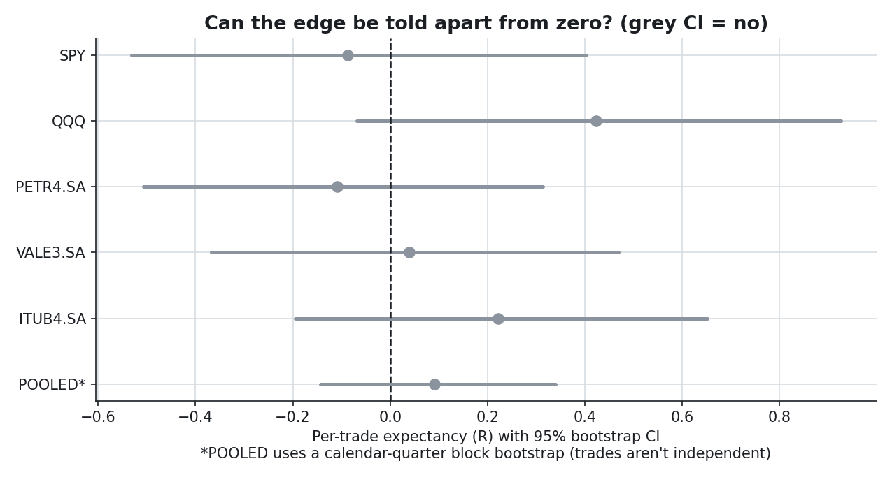
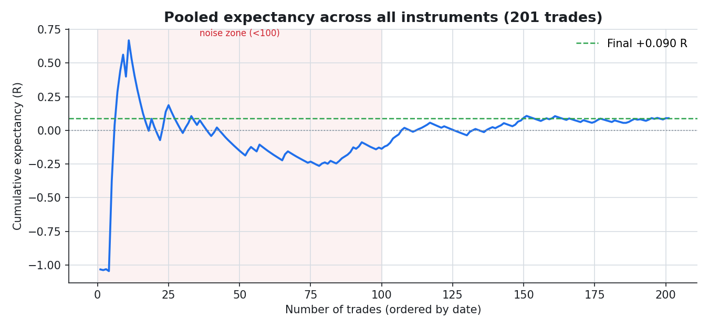
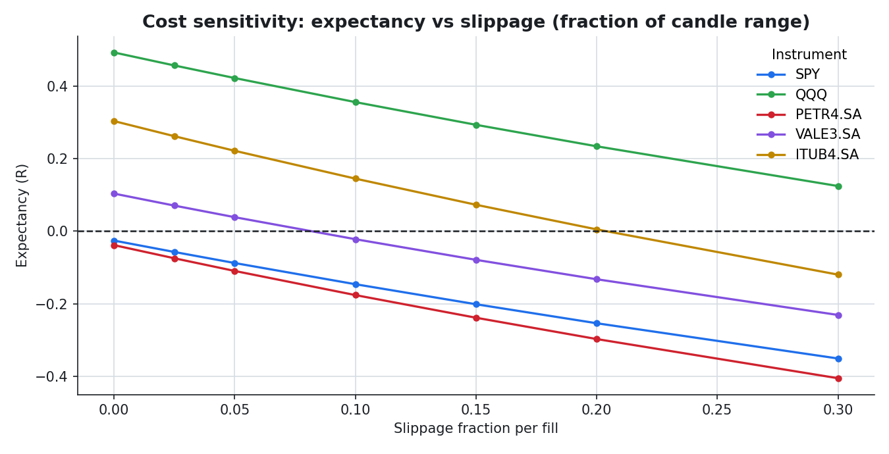
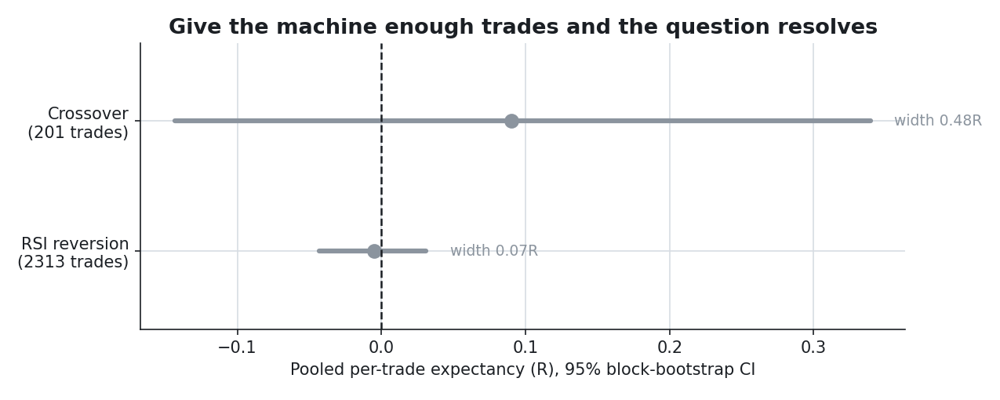
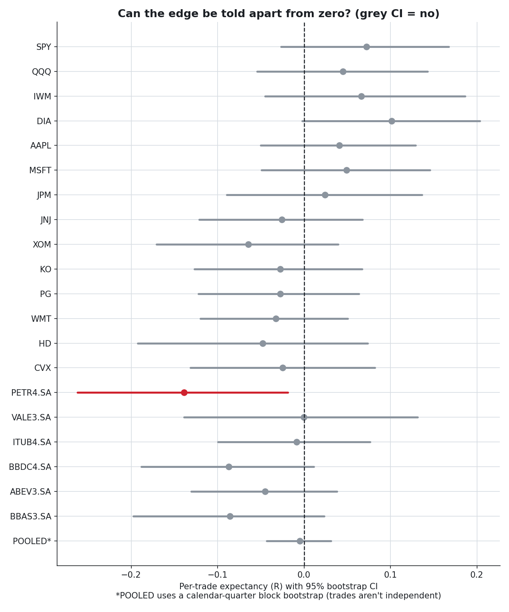
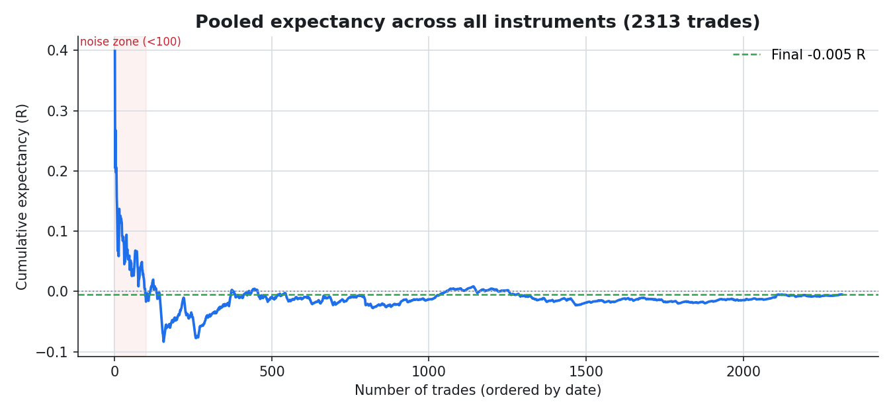
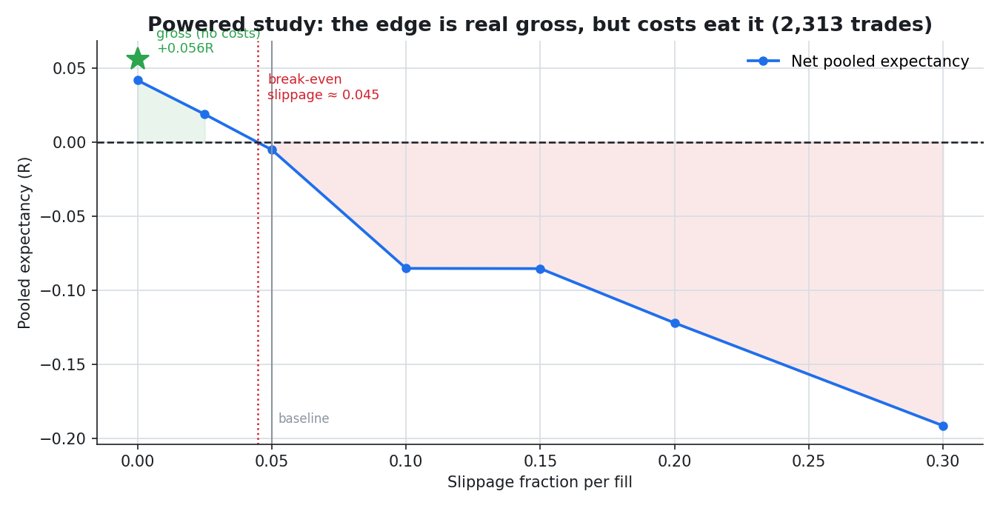

# Expectancy — The Mathematics of a Trading System

[](https://www.python.org/)
[](LICENSE)
[](tests/)
[](https://finance.yahoo.com/)
[](output/expectancy_study.pdf)

A rules-based backtester that measures the **mathematical fingerprint** of a trading system —
**win rate, expectancy, R-multiple, equity curve, max drawdown, variance and risk of ruin** — on real
OHLCV from Yahoo Finance. It is built around one non-negotiable principle: these numbers are **not
data you download**, they are **results of simulating a strategy** trade by trade, after costs, with
no lookahead.

The question this repo answers is not "what was the return?" but **"does this system have a real edge,
and could I survive the variance of trading it?"** It then runs the same example strategy across five
instruments and reports the answer without spin.

---

## TL;DR

- **The example strategy (MA20×MA50 crossover) shows no edge the data can confirm.** After costs,
  the per-trade expectancy *swings across instruments* — QQQ **+0.42R**, ITUB4 **+0.22R**, SPY
  **−0.09R**, PETR4 **−0.11R** — but with only ~40 trades each, that spread is exactly what pure chance
  produces even if the true edge were identical (or zero) everywhere.
- **Statistically, every instrument is a coin-flip.** The **95% bootstrap confidence interval on
  expectancy straddles zero for all five** — and even **pooling all 201 trades** (with a correlation-
  aware *block* bootstrap) leaves it at **[−0.14R, +0.34R]**, still including zero (P(edge > 0) ≈ 77%).
  The honest verdict is not "no edge" but **"underpowered — a small edge cannot be told apart from
  none."**
- **Variance dominates the experience.** Bootstrapping QQQ's trades 5,000 times, the outcome runs
  from a **4.7% chance of ending in the red** (despite a positive point estimate) to ~**+17% at the
  95th percentile** — same trades, same expectancy, a very different ride from luck of sequence alone.
- **Risk of ruin explodes non-linearly, and the edge is thin to costs.** At ≤ 2% risk per trade a
  50% drawdown is ~0% likely; at **5% per trade** it jumps to **37–38%** on the weakest names. And a
  small bump in slippage flips the marginal instruments negative — the conclusion of "who wins" hangs
  on the cost assumption.
- **The recovery math is unforgiving:** a 50% drawdown needs a **100%** gain to undo. This is why the
  system measures *survival*, not just return.
- **Give the machine enough trades and it resolves the question.** Swapping in a *frequent* strategy
  (RSI(2) mean-reversion) over a 20-instrument basket yields **2,313 trades** — and the pooled CI
  collapses from 0.48R wide (undecidable) to **[−0.04R, +0.03R]**, a tight band on zero. The verdict
  sharpens from "we can't tell" to **"zero edge after costs"** — same engine, only the sample changed.
  And the richest detail: the **gross signal is genuinely +0.056R**; it is *costs* that erase it, dying
  at a break-even slippage of ≈0.045 — a real but small edge only a low-cost desk could keep.

> **One-sentence verdict:** the value here is not the strategy — it is a backtester honest enough to
> say "underpowered, can't tell" on 40 trades and "precisely zero edge after costs" on 2,300, and to
> show that variance and position sizing dominate the outcome either way.

**Full 25-page technical report:** [`output/expectancy_study.pdf`](output/expectancy_study.pdf)

---

## Table of contents

- [The four pillars](#the-four-pillars)
- [Data & methodology](#data--methodology)
- [Results](#results)
  - [1. The cross-instrument scorecard](#1-the-cross-instrument-scorecard)
  - [2. Win rate vs the breakeven it must clear](#2-win-rate-vs-the-breakeven-it-must-clear)
  - [3. Is the edge real? The significance test](#3-is-the-edge-real-the-significance-test)
  - [4. Pooling for power & an out-of-sample split](#4-pooling-for-power--an-out-of-sample-split)
  - [5. The edge is thin: cost sensitivity](#5-the-edge-is-thin-cost-sensitivity)
  - [6. Giving the machine enough trades](#6-giving-the-machine-enough-trades)
  - [7. Variance changes everything](#7-variance-changes-everything)
  - [8. Risk of ruin & the risk dial](#8-risk-of-ruin--the-risk-dial)
  - [9. The recovery math](#9-the-recovery-math)
- [Conclusions](#conclusions)
- [Reproduce it](#reproduce-it)
- [Project structure](#project-structure)
- [Reference document](#reference-document)
- [Disclaimer](#disclaimer)

---

## The four pillars

The system measures the four things that actually describe a trading method:

| Pillar | What it answers | How it is measured here |
|---|---|---|
| **Expectancy** | Does each trade make money on average? | `WR × avg_win − LR × avg_loss`, in money **and** in R, validated against the realized mean |
| **Variance** | Could the same edge feel like a disaster? | 5,000-sample bootstrap of the realized trades — median path, 5–95% band, best/worst |
| **Risk / reward** | Is the payoff worth the hit rate? | R-multiples, payoff ratio, and the breakeven win rate `1/(R+1)` shown next to the real one |
| **Survival** | Could the account die before the edge pays? | Monte-Carlo risk of ruin by bet size, plus the loss → recovery asymmetry |

Everything downstream of the raw OHLCV is computed, never downloaded.

## Data & methodology

| | |
|---|---|
| **Source** | [Yahoo Finance](https://finance.yahoo.com/) via `yfinance`, downloaded once and cached as Parquet |
| **Instruments** | Core study: SPY, QQQ · PETR4.SA, VALE3.SA, ITUB4.SA. Powered study: a 20-name US+BR basket |
| **History** | Daily, adjusted OHLCV, 2010-01-01 → 2026-01-01 (a common window for a fair comparison) |
| **Strategies** | MA20×MA50 crossover (ATR stop/target) and RSI(2) mean-reversion (signal exit) — both pluggable |
| **King metric** | **Per-trade expectancy after costs**, in money and in R; plus PF, drawdown, Sharpe/Sortino |
| **Costs** | Spread + commission + slippage, charged round-trip on **every** trade |
| **Sizing** | Fixed-fractional: each trade risks **0.5% of equity**; a wider stop ⇒ a smaller position |
| **No lookahead** | A signal at the close of bar *t* is executed at the **open of bar t+1**, never at its own close |
| **Variance/ruin** | 5,000-sample bootstrap (with replacement) with a **fixed seed** (42) for reproducibility |
| **Significance** | 10,000-sample bootstrap **95% CI** on expectancy; **pooling** to ~200 trades with a correlation-aware **block bootstrap**; chronological **out-of-sample** split; **cost-sensitivity** sweep |

All figures and tables below come straight from the pipeline (`scripts/run_study.py` →
`scripts/build_report.py`); nothing is hand-edited.

## Results

### 1. The cross-instrument scorecard

The same strategy, same parameters, run on every instrument. The point estimates *look* like a result —
some markets positive, some negative — but hold that thought: with ~40 trades each, this spread is also
exactly what randomness would paint on top of a single, identical (even zero) edge. Section 3 puts error
bars on it.


| Instrument | Trades | Win rate | Expectancy (R) | Expectancy ($) | Profit factor | Max DD | Verdict (§3) |
|---|---|---|---|---|---|---|---|
| SPY | 39 | 30.8% | **−0.088** | −4.61 | 0.87 | 5.6% | unconfirmed |
| QQQ | 37 | 51.4% | **+0.422** | +21.63 | 1.83 | 1.9% | unconfirmed |
| PETR4.SA | 42 | 35.7% | **−0.109** | −5.63 | 0.84 | 3.7% | unconfirmed |
| VALE3.SA | 43 | 41.9% | **+0.039** | +1.70 | 1.06 | 3.6% | unconfirmed |
| ITUB4.SA | 40 | 47.5% | **+0.222** | +11.09 | 1.40 | 4.7% | unconfirmed |

*Expectancy after costs. The point estimates are positive on three names and negative on two — but the
"Verdict" column deliberately does **not** call any of them an edge, because (as §3 shows) every
confidence interval straddles zero. Reporting "edge: yes" off the sign of a 40-trade mean would be the
exact mistake this study exists to debunk. The expectancy sanity check (`formula == realized mean`)
passes for all five: the arithmetic is right even where the conclusion is undecidable.*

### 2. Win rate vs the breakeven it must clear

A 3:1 payoff target only needs ~25% wins to break even, so a "low" win rate is not automatically bad —
what matters is the win rate **relative to its breakeven**. Plotting both makes the margin (or lack of
it) obvious.


*Where the blue bar clears the grey one, the system has positive expectancy (QQQ, ITUB4, VALE3); where
it falls short (SPY, PETR4), it bleeds. The gaps are thin — this is a marginal system, not a money
printer.*

### 3. Is the edge real? The significance test

A point estimate without an interval is a guess with a confident voice. Bootstrapping the per-trade
expectancy (resampling the realized R-multiples **with replacement** 10,000 times and taking the
2.5th–97.5th percentiles of the mean) gives a 95% confidence interval. Where it crosses zero, a small
edge cannot be told apart from no edge.



| Instrument | Trades | Expectancy (R) | 95% CI (R) | P(edge > 0) | Verdict |
|---|---|---|---|---|---|
| SPY | 39 | −0.088 | [−0.53, +0.40] | 34% | indistinguishable from zero |
| QQQ | 37 | +0.422 | [−0.07, +0.93] | 95% | indistinguishable from zero |
| PETR4.SA | 42 | −0.109 | [−0.51, +0.31] | 30% | indistinguishable from zero |
| VALE3.SA | 43 | +0.039 | [−0.37, +0.47] | 57% | indistinguishable from zero |
| ITUB4.SA | 40 | +0.222 | [−0.20, +0.65] | 85% | indistinguishable from zero |

*Every single interval straddles zero (all grey in the forest plot). At ~40 trades, the data cannot
confirm an edge in **any** direction — the result the headline scorecard hides, and the honest centre of
the whole study.*

Two caveats make it even more sober. **QQQ sits exactly on the boundary** (P(edge > 0) = 95%), so
calling it positive would be a one-tailed knife-edge, not a finding. And **multiple comparisons** bite:
across five instruments, the chance that at least one clears a 95% one-sided bar by luck alone is
1 − 0.95⁵ ≈ **23%**. Finding one borderline name among five is roughly what pure noise predicts — a
reason *not* to get excited about QQQ.

### 4. Pooling for power & an out-of-sample split

If no single instrument has enough trades, pool them. Because R normalises each trade by its risk, the
201 trades from all five instruments form one comparable stream — finally crossing the ~100-trade
threshold where expectancy begins to settle.



The pooled expectancy is **+0.090R** — but those 201 trades are **not independent**. US indices are
~0.9 correlated and the Brazilian names move together, so trades firing in the same period carry
redundant information. A plain i.i.d. bootstrap shreds that correlation and reports a falsely tight
interval; a **calendar-quarter block bootstrap** (resampling whole quarters, preserving the dependence)
gives the honest one:

| Pooled 95% CI | Interval (R) | P(edge > 0) | Reads as |
|---|---|---|---|
| i.i.d. bootstrap (optimistic) | [−0.11, +0.30] | 81% | includes zero |
| **block bootstrap** (58 quarters, honest) | **[−0.14, +0.34]** | 77% | **includes zero** |

*The honest interval is ~20% wider — the effective sample is closer to the ~58 quarters than to 201
trades. The conclusion does not change (zero is still inside), but the report no longer understates its
own uncertainty. (A bias-corrected **BCa** bootstrap would refine the skew of these intervals, but since
the percentile and block versions already agree on the verdict, it would not change it.)*

Splitting the pool chronologically gives a genuine out-of-sample check:

| Pool split | Trades | Expectancy (R) |
|---|---|---|
| In-sample (first half) | 100 | **−0.137** |
| Out-of-sample (second half) | 101 | **+0.316** |

*Two honest signals at once. First: even at 201 trades the running average is still wandering — the
shaded "noise zone" (< 100 trades) swings from −1R to +0.6R before calming. Second: the out-of-sample
half is **better** than the in-sample half, so this is **not** a classic over-fit; if anything the
positive trades cluster in the later (post-2020) regime — which is itself a warning that the "edge" may
be regime exposure, not skill. Either way, the pooled CI still includes zero.*

### 5. The edge is thin: cost sensitivity

Where expectancy is a fraction of an R, the cost assumption is a lever, not a footnote. Sweeping the
slippage assumption shows how fast each instrument's edge crosses into the red.



*At the baseline 0.05 slippage, QQQ and ITUB4 look positive — but VALE3 is already breakeven, and a
modest rise in slippage drags ITUB4 negative and halves QQQ. The ranking of "who wins" is not robust to
a parameter nobody can pin down precisely. This is the cost warning from the source material, made
literal.*

### 6. Giving the machine enough trades

Every limitation in sections 1–5 traces to one root cause: a daily moving-average crossover fires
~2.5 times a year, so even 16 years cannot power the test. The fix is not statistical — it is the
**sample**. Swap in a *frequent* strategy (an RSI(2) mean-reversion that buys short-term dips inside
uptrends, exiting when the dip unwinds) over a **20-instrument basket**, and the *same engine* produces
**2,313 trades**. This is the whole point: the motor was never the bottleneck, the setup was.



The pooled 95% block-bootstrap CI **collapses from 0.48R wide (crossover, undecidable) to 0.07R wide**:

| Pooled study | Trades | Expectancy (R) | Block CI (R) | Reads as |
|---|---|---|---|---|
| Crossover (underpowered) | 201 | +0.090 | [−0.14, +0.34] | can't tell |
| **RSI reversion (powered)** | **2,313** | **−0.005** | **[−0.04, +0.03]** | **precisely ~zero** |



The verdict sharpens from "we cannot tell" to **"the edge is, to a tight tolerance, zero after costs."**
The high **60–68% win rates** on US indices are the genuine mean-reversion signature — but the small
per-trade gains are eaten by spread and slippage, leaving expectancy on top of zero. With ~100+ trades
each, several instruments now resolve individually (PETR4 turns *significantly negative*), and the
pooled band sits right on the line. In-sample (−0.001R) and out-of-sample (−0.009R) agree, so it is
stable, not a fluke.



**Gross vs net — where the edge actually dies.** The "zero after costs" verdict rests on one cost
assumption, so it is stressed on the study that depends on it (the cost sweep, unlike v1, is run on the
*powered* basket). With **all frictions removed the pooled signal is +0.056R** — genuinely positive. It
is the costs that erase it: the pooled edge crosses zero at a **break-even slippage of ≈ 0.045** of the
candle range, right around the realistic baseline.



*The reading is precise and practical: the mean-reversion signal is **real but small**, and only a
low-cost (e.g. institutional) participant operating below the break-even slippage would keep it; at
retail frictions it nets to nothing. This is the richest result in the project — not "no signal," but
"a real signal that costs eat" — and it only becomes visible once the sample is large enough to measure
it.*

> **A note on the basket.** These 20 names are liquid blue chips that exist *today*, so the selection is
> survivor-biased. Crucially that bias works *in favour* of finding an edge (survivors are the winners) —
> and the result is still ~zero net. The null finding is therefore conservative: a survivorship-free
> basket would, if anything, look worse.

*This is the lesson the whole project was built to deliver: the backtester resolves the question the
moment it is given enough trades — and the honest answer for this textbook strategy, after costs, is no
net edge. Exactly what efficient-market priors predict, now measured rather than asserted.*

### 7. Variance changes everything

Even taking the trades at face value, a single equity curve hides the role of luck. Bootstrap QQQ's
trades (resample **with replacement**) 5,000 times and rebuild the account each time — same trades,
same expectancy, very different journeys.


*The realized run (dashed) is just one draw from the blue cone. Across the 5,000 simulations QQQ ends
below its starting capital **4.7%** of the time despite a positive point estimate, and because it risks
only 0.5% per trade over 37 trades the lucky 95th-percentile tail still only reaches ~+17%. (Note: a
mere reshuffle of the same trades would give an identical final equity under fixed-fractional sizing —
a product is commutative — so resampling **with replacement** is what disperses the destination, not
just the path.)*

### 8. Risk of ruin & the risk dial

The probability of a catastrophic drawdown is driven less by the strategy than by **how much you bet
per trade**. The same trade stream, replayed at different risk levels, shows the non-linear blow-up.


| Risk per trade | SPY P(DD ≥ 50%) | PETR4 P(DD ≥ 50%) | ITUB4 P(DD ≥ 50%) |
|---|---|---|---|
| 0.5% | 0.0% | 0.0% | 0.0% |
| 1.0% | 0.0% | 0.0% | 0.0% |
| 2.0% | 0.0% | 0.0% | 0.0% |
| 5.0% | **37.2%** | **38.0%** | **3.6%** |

*Below 2% risk the deep-drawdown probability is effectively zero everywhere; at 5% it explodes — and it
explodes *fastest* on the negative-edge instruments. The lesson the maths forces: the risk dial ends
more accounts than the entry signal.*

### 9. The recovery math

Losses and the gains needed to undo them are asymmetric — which is why protecting capital beats
chasing return.

| Drawdown suffered | Gain required to recover |
|---|---|
| 10% | 11% |
| 20% | 25% |
| 30% | 43% |
| 40% | 67% |
| 50% | **100%** |

*A 50% loss does not need 50% back — it needs to *double*. Combined with the risk-of-ruin table, this
is the whole argument for sizing small.*

## Conclusions

1. **The strategy's edge cannot be confirmed — or ruled out — at this sample size.** Every per-trade
   expectancy CI straddles zero, and so does the pooled one even after a correlation-aware block
   bootstrap (201 trades, [−0.14R, +0.34R]). The honest statement is "underpowered," not "no edge."
   With ~40 trades per instrument, the eye-catching spread from −0.11R to +0.42R is well within what
   noise alone would produce over a common true edge.
2. **A moving-average crossover on daily bars is structurally underpowered.** It fires ~2.5 times a
   year, so even 16 years cannot generate the trades needed to validate or invalidate it. That — more
   than the strategy being "good" or "bad" — is the concrete lesson here.
3. **Given power, the question resolves — into a precise gross-vs-net result.** A frequent strategy
   (RSI(2) reversion) over a 20-name basket produces 2,313 trades, and the pooled CI tightens to
   [−0.04R, +0.03R]: a precise zero *after costs*, in- and out-of-sample agreeing. But the gross signal
   is genuinely **+0.056R** — the edge is real and small, and costs (break-even slippage ≈0.045) are what
   erase it. The bottleneck was never the engine; it was the sample. Swap the setup, not the motor, and
   the machine delivers a verdict — and even tells you who could still trade it.
4. **Variance and position sizing dominate the outcome.** Bootstrapped, the same trades give very
   different equity paths, and the risk dial controls survival far more than the entry rule does. The
   thin edge is also fragile to the cost assumption.
5. **The deliverable is the method, not the money.** A backtester that refuses to lie — no lookahead,
   full costs, fixed-fractional risk, a forced expectancy sanity check, bootstrap confidence intervals,
   pooling, an out-of-sample split and reproducible Monte-Carlo — is what lets you separate a real edge
   from a lucky one. Across two strategies and 2,500 trades it found none — and said so, precisely.

> The backtester *measures* an edge; it does not *create* one. Plug in a strategy that trades often
> enough to have genuine statistical power, and the same machinery will resolve the question — honestly,
> with its variance and its risk of ruin. The engine is already built for it; swap the strategy and the
> sample, not the motor.

## Reproduce it

The first run downloads and caches the data; later runs are offline. The figures and the PDF report are
committed, so you can read the study without running anything.

```powershell
# Windows / PowerShell (Python 3.12+)
py -3.12 -m venv .venv
& ".venv\Scripts\Activate.ps1"          # if blocked: Set-ExecutionPolicy -Scope Process -ExecutionPolicy Bypass
pip install -r requirements.txt
pip install -e .

pytest -q                               # 47 tests
python main.py                          # single instrument from config.yaml (full scorecard + figures)
python scripts/run_study.py             # the underpowered crossover basket (US+BR)
python scripts/run_powered_study.py     # the powered RSI-reversion study (20-name basket)
python scripts/build_report.py          # renders output/figures/*.png and the PDF report
```

```bash
# macOS / Linux
python3.12 -m venv .venv
source .venv/bin/activate
pip install -r requirements.txt && pip install -e .
pytest -q
python main.py
python scripts/run_study.py && python scripts/run_powered_study.py && python scripts/build_report.py
```

Change the instrument, period, costs, risk and strategy parameters in [`config.yaml`](config.yaml);
nothing requires touching code.

## Project structure

```
src/expectancy/
  config.py        typed config loaded from config.yaml
  data/            yfinance download + Parquet cache + cleaning (the only networked layer)
  strategy/        pluggable Strategy base, MA-crossover (ATR stop/target), RSI(2) reversion (signal exit)
  engine/          trade-by-trade simulation (t→t+1 execution, costs, sizing, R, stop/target/signal exits)
  metrics/         the scorecard: expectancy ($ & R), profit factor, breakeven WR, drawdown, Sharpe
  montecarlo/      bootstrap variance, risk of ruin by bet size, recovery math
  analysis/        significance (bootstrap + block bootstrap CI), pooling + out-of-sample split, cost sensitivity
  reporting/       terminal report, matplotlib figures, and the reportlab PDF
  runner.py        wires the layers into one backtest run
scripts/           run_study.py (crossover) · run_powered_study.py (RSI basket) · build_report.py
main.py            single-instrument entry point (the brief's acceptance criterion)
tests/             47 tests: lookahead, R-multiples, signal/max-hold exits, expectancy sanity, significance
output/figures/    the figures used in the report and this README (committed)
```

## Reference document

[`BACKTEST_BRIEF.md`](BACKTEST_BRIEF.md) — the full specification this project implements: the four
pillars, the no-lookahead rule, the cost and sizing model, the Monte-Carlo requirements and the
quality checklist.

## Disclaimer

This is an educational and research project. **Nothing here is investment advice.** The example
strategy is a didactic moving-average crossover, not a system with a guaranteed edge. Retail trading
has a negative base rate and leverage carries the risk of total loss. Past performance does not
guarantee future results.

Licensed under the [MIT License](LICENSE).
